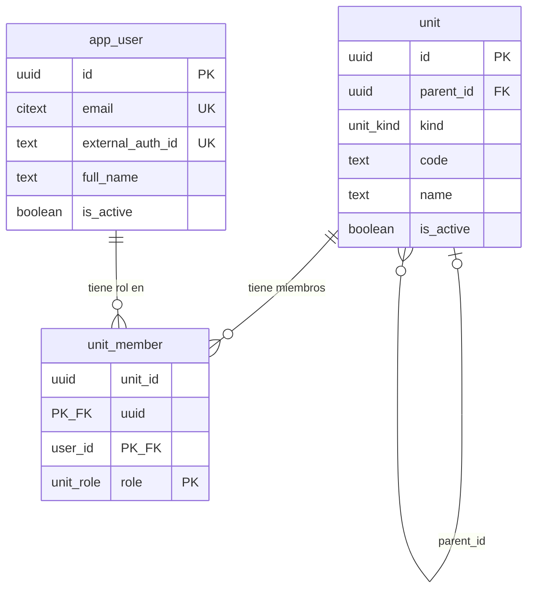

# Modelo de datos — gestión logística de comunidad de vivienda

Esquema PostgreSQL (13+). Dos piezas: la **unidad**, anidable a sí misma, y los **usuarios**, que tienen un rol sobre alguna unidad del árbol.

```
community (comunidad)            ← admin, staff
└── building (edificio)          ← staff
    └── apartment (departamento) ← owner, tenant
        └── account (cuenta de cobro)
```

## Archivos

| Archivo      | Contenido                                                             |
|--------------|-----------------------------------------------------------------------|
| `schema.sql` | Esquemas `units` y `users`, enums, tablas, índices y triggers `updated_at` |
| `seed.sql`   | Datos de ejemplo: 1 comunidad, 2 edificios, 4 departamentos, 4 cuentas, 5 usuarios, 6 membresías |
| `modelo.mmd` | Diagrama ER en Mermaid                                                |

Con Docker (desde `proyectos/logistica-comunidad/`, credenciales en `.env`):

```bash
docker compose up -d db
docker compose exec db psql -U comunidad -d comunidad -c '\dt units.*' -c '\dt users.*'
```

Los scripts se ejecutan solos la primera vez que se crea el volumen. Tras cambiar `schema.sql`: `docker compose down -v && docker compose up -d db`.

Con un Postgres propio:

```bash
createdb comunidad
psql -d comunidad -f schema.sql
psql -d comunidad -f seed.sql
```

## Esquemas

| Esquema  | Contenido |
|----------|-----------|
| `units`  | `unit` |
| `users`  | `app_user`, `unit_member` |
| `public` | Enums `unit_kind`, `unit_role` y la función `set_updated_at()` |

En Prisma el datasource declara `schemas = ["public", "units", "users"]` y cada modelo lleva `@@schema(...)`.

## Diagrama ER



## Entidades

### Unidades

| Tabla  | Descripción |
|--------|-------------|
| `unit` | Nodo del árbol. `kind` dice qué es; `parent_id` de quién cuelga. `code` es el identificador visible ("A", "101", "GC") y es único entre hermanos. `name` es opcional. `is_active = false` desactiva sin borrar. |

### Usuarios

| Tabla         | Descripción |
|---------------|-------------|
| `app_user`    | Cuenta. La identidad se delega a un proveedor externo (`external_auth_id`); no hay contraseña. |
| `unit_member` | Rol de un usuario sobre una unidad: `admin`, `owner`, `tenant`, `staff`. Un usuario puede tener varios roles y varias unidades (p. ej. dueño de dos departamentos). |

## Reglas

- **Raíz**: `kind = 'community'` ⇔ `parent_id IS NULL` (constraint `unit_root_is_community`). Todo lo demás tiene padre.
- **Jerarquía flexible**: no se valida que el padre sea del tipo inmediatamente superior. Se pueden intercalar niveles o agregar tipos con `ALTER TYPE unit_kind ADD VALUE`.
- **Ciclos**: la base solo impide que una unidad sea su propio padre. Evitar ciclos al reasignar `parent_id` es responsabilidad de la aplicación.
- **Alcance del rol**: el rol en `unit_member` aplica a la unidad y a todo su subárbol (admin de la comunidad ve todo; owner de un departamento ve su cuenta). La base no restringe qué rol va en qué tipo de unidad; lo decide la aplicación.
- **Borrado**: `ON DELETE CASCADE` desde el padre y desde `app_user`; borrar una comunidad borra su árbol y las membresías.

## Convenciones

- PK `uuid` con `gen_random_uuid()`; timestamps `timestamptz`; `updated_at` mantenido por trigger.
- `email` es `citext` (único sin distinguir mayúsculas).
- Estados y tipos como `ENUM` de Postgres.

## Consultas típicas

```sql
-- Subárbol completo de una comunidad, con profundidad y ruta de códigos
WITH RECURSIVE tree AS (
  SELECT id, parent_id, kind, code, 0 AS depth, code::text AS path
  FROM units.unit WHERE id = '10000000-0000-4000-8000-000000000001'
  UNION ALL
  SELECT u.id, u.parent_id, u.kind, u.code, t.depth + 1, t.path || ' / ' || u.code
  FROM units.unit u JOIN tree t ON u.parent_id = t.id
)
SELECT depth, kind, path FROM tree ORDER BY path;

-- Unidades a las que un usuario tiene acceso (sus membresías y todo lo que cuelga de ellas)
WITH RECURSIVE reach AS (
  SELECT m.unit_id AS id, m.role FROM users.unit_member m
  WHERE m.user_id = '50000000-0000-4000-8000-000000000002'
  UNION
  SELECT u.id, r.role FROM units.unit u JOIN reach r ON u.parent_id = r.id
)
SELECT r.role, u.kind, u.code FROM reach r JOIN units.unit u ON u.id = r.id ORDER BY 1, 2, 3;

-- Quién vive o es dueño de un departamento
SELECT m.role, a.full_name, a.email
FROM users.unit_member m JOIN users.app_user a ON a.id = m.user_id
WHERE m.unit_id = '30000000-0000-4000-8000-000000000001';
```
