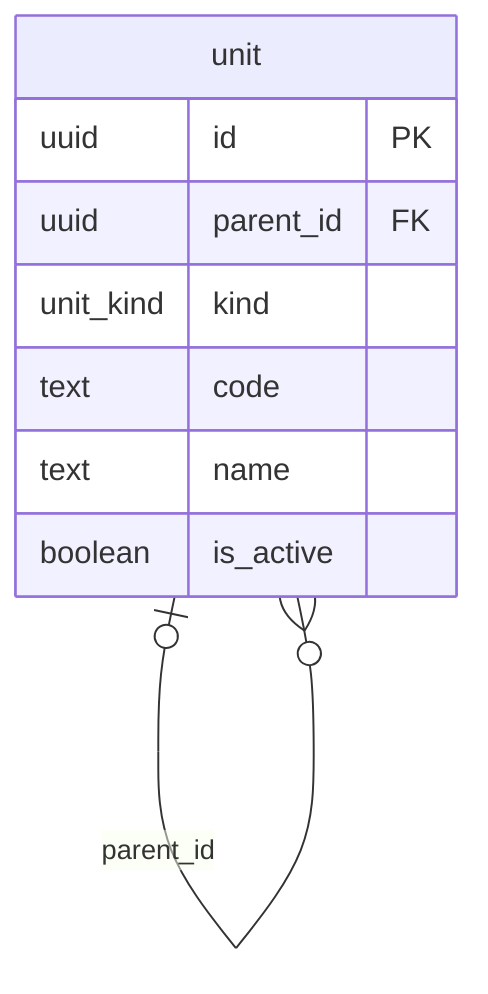

# Modelo de datos — gestión logística de comunidad de vivienda

Esquema PostgreSQL (13+). Parte de una sola entidad, la **unidad**, anidable a sí misma:

```
community (comunidad)
└── building (edificio)
    └── apartment (departamento)
        └── account (cuenta de cobro)
```

## Archivos

| Archivo      | Contenido                                                             |
|--------------|-----------------------------------------------------------------------|
| `schema.sql` | Esquema `units`, enum `unit_kind`, tabla `unit`, índices y trigger `updated_at` |
| `seed.sql`   | Datos de ejemplo: 1 comunidad, 2 edificios, 4 departamentos, 4 cuentas |
| `modelo.mmd` | Diagrama ER en Mermaid                                                |

Con Docker (desde `proyectos/logistica-comunidad/`, credenciales en `.env`):

```bash
docker compose up -d db
docker compose exec db psql -U comunidad -d comunidad -c '\dt units.*'
```

Los scripts se ejecutan solos la primera vez que se crea el volumen. Tras cambiar `schema.sql`: `docker compose down -v && docker compose up -d db`.

Con un Postgres propio:

```bash
createdb comunidad
psql -d comunidad -f schema.sql
psql -d comunidad -f seed.sql
```

## Esquemas

| Esquema  | Contenido |
|----------|-----------|
| `units`  | `unit` |
| `public` | Enum `unit_kind` y la función `set_updated_at()` |

En Prisma el datasource declara `schemas = ["public", "units"]` y el modelo lleva `@@schema("units")`.

## Diagrama ER



## Entidades

| Tabla  | Descripción |
|--------|-------------|
| `unit` | Nodo del árbol. `kind` dice qué es; `parent_id` de quién cuelga. `code` es el identificador visible ("A", "101", "GC") y es único entre hermanos. `name` es opcional. `is_active = false` desactiva sin borrar. |

## Reglas

- **Raíz**: `kind = 'community'` ⇔ `parent_id IS NULL` (constraint `unit_root_is_community`). Todo lo demás tiene padre.
- **Jerarquía flexible**: no se valida que el padre sea del tipo inmediatamente superior. Se pueden intercalar niveles (p. ej. `building > building` para torre y piso) o agregar tipos con `ALTER TYPE unit_kind ADD VALUE`.
- **Ciclos**: la base solo impide que una unidad sea su propio padre. Evitar ciclos al reasignar `parent_id` es responsabilidad de la aplicación.
- **Borrado**: `ON DELETE CASCADE` desde el padre; borrar una comunidad borra todo su árbol.

## Convenciones

- PK `uuid` con `gen_random_uuid()`; timestamps `timestamptz`; `updated_at` mantenido por trigger.
- Estados y tipos como `ENUM` de Postgres.

## Consultas típicas

```sql
-- Subárbol completo de una comunidad, con profundidad y ruta de códigos
WITH RECURSIVE tree AS (
  SELECT id, parent_id, kind, code, 0 AS depth, code::text AS path
  FROM units.unit WHERE id = '10000000-0000-4000-8000-000000000001'
  UNION ALL
  SELECT u.id, u.parent_id, u.kind, u.code, t.depth + 1, t.path || ' / ' || u.code
  FROM units.unit u JOIN tree t ON u.parent_id = t.id
)
SELECT depth, kind, path FROM tree ORDER BY path;

-- Ancestros de una cuenta (de la cuenta hacia la comunidad)
WITH RECURSIVE up AS (
  SELECT id, parent_id, kind, code FROM units.unit WHERE id = '40000000-0000-4000-8000-000000000001'
  UNION ALL
  SELECT u.id, u.parent_id, u.kind, u.code FROM units.unit u JOIN up ON u.id = up.parent_id
)
SELECT kind, code FROM up;
```
