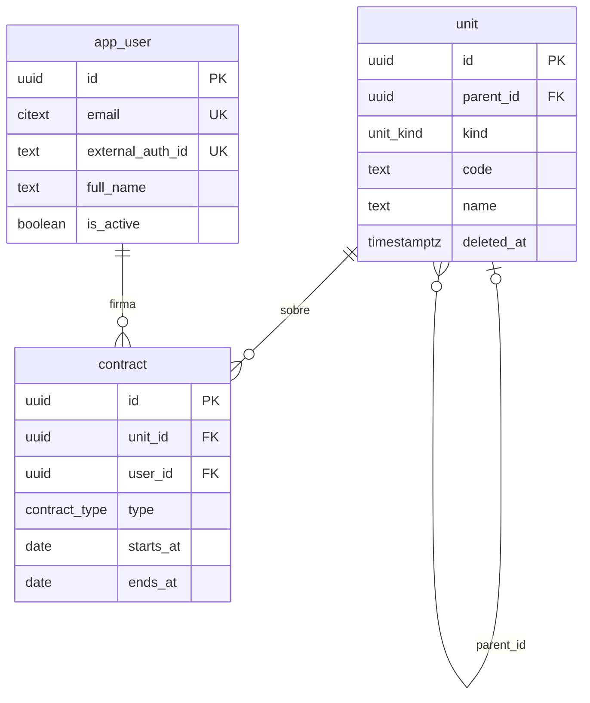

# Modelo de datos — gestión logística de comunidad de vivienda

Esquema PostgreSQL (13+). Tres piezas: la **unidad**, anidable a sí misma; los **usuarios**, vinculados a las unidades mediante **contratos**; y los **roles**, que agrupan permisos de la aplicación y se asignan a usuarios.

```
community (comunidad)            ← administration, employment
└── building (edificio)          ← employment
    └── apartment (departamento) ← ownership, lease
        └── account (cuenta de cobro)
```

## Archivos

| Archivo      | Contenido                                                             |
|--------------|-----------------------------------------------------------------------|
| `schema.sql` | Esquemas `units`, `users` y `auth`, enums, tablas, índices parciales, triggers, catálogo de permisos y rol Administrador |
| `seed.sql`   | Datos de ejemplo: 1 comunidad, 2 edificios, 4 departamentos, 4 cuentas, 5 usuarios, 7 contratos, roles Conserje y Residente y su asignación |
| `modelo.mmd` | Diagrama ER en Mermaid                                                |

Con Docker (desde `proyectos/logistica-comunidad/`, credenciales en `.env`):

```bash
docker compose up -d db
docker compose exec db psql -U comunidad -d comunidad -c '\dt units.*' -c '\dt users.*'
```

Los scripts se ejecutan solos la primera vez que se crea el volumen. Tras cambiar `schema.sql`: `docker compose down -v && docker compose up -d db`.

Con un Postgres propio:

```bash
createdb comunidad
psql -d comunidad -f schema.sql
psql -d comunidad -f seed.sql
```

## Esquemas

| Esquema  | Contenido |
|----------|-----------|
| `units`  | `unit` |
| `users`  | `app_user`, `contract` |
| `auth`   | `permission`, `role`, `role_permission`, `user_role` |
| `public` | Enums `unit_kind`, `contract_type` y las funciones `set_updated_at()` y `unit_rank()` |

En Prisma el datasource declara `schemas = ["auth", "public", "units", "users"]` y cada modelo lleva `@@schema(...)`.

## Diagrama ER



## Entidades

### Unidades

| Tabla  | Descripción |
|--------|-------------|
| `unit` | Nodo del árbol. `kind` dice qué es; `parent_id` de quién cuelga. `code` es el identificador visible ("A", "101", "GC") y es único entre hermanos vivos. `name` es opcional. `deleted_at` distinto de NULL = eliminada lógicamente. |

### Usuarios

| Tabla         | Descripción |
|---------------|-------------|
| `app_user`    | Cuenta. La identidad se delega a un proveedor externo (`external_auth_id`); no hay contraseña. |
| `contract`    | Relación entre una persona y una unidad. `type`: `ownership`, `lease`, `administration`, `employment`. Con `starts_at`/`ends_at` (NULL = sin término) y `document_url` opcional. Una persona puede tener varios contratos, con distintas unidades o con la misma a lo largo del tiempo (renovaciones). |

### Roles y permisos

| Tabla             | Descripción |
|-------------------|-------------|
| `permission`      | Catálogo fijo de acciones del código, `recurso.accion` (`units.write`). Lo carga `schema.sql`; el admin no lo edita. |
| `role`            | Rol global de la aplicación con nombre único entre vivos y borrado lógico. `is_system` marca los base (Administrador): no se eliminan ni renombran, sí cambian de permisos. |
| `role_permission` | Permisos de cada rol. |
| `user_role`       | Roles de cada usuario. Los roles son globales; qué administra cada persona sobre cada unidad lo dicen los contratos. |

## Reglas

- **Raíz**: `kind = 'community'` ⇔ `parent_id IS NULL` (constraint `unit_root_is_community`). Todo lo demás tiene padre.
- **Orden de la jerarquía**: `unit_rank()` da community 0, building 1, apartment 2, account 3. El trigger `unit_check_rank` exige que el padre tenga rango menor que la unidad y que, al cambiar el tipo, todos sus hijos tengan rango mayor. Se pueden saltar niveles (departamento directo bajo comunidad); no se puede anidar el mismo tipo ni invertir el orden. Para agregar un tipo: `ALTER TYPE unit_kind ADD VALUE` y darle rango en `unit_rank()`.
- **Ciclos**: la base solo impide que una unidad sea su propio padre. Evitar ciclos al reasignar `parent_id` es responsabilidad de la aplicación.
- **Alcance del contrato**: aplica a la unidad y a todo su subárbol (administración de la comunidad ve todo; dueño de un departamento ve su cuenta). La base no restringe qué tipo de contrato va en qué tipo de unidad; lo decide la aplicación.
- **Vigencia**: un contrato está vigente si `starts_at <= hoy` y (`ends_at IS NULL` o `ends_at >= hoy`). La base no impide solapamientos entre contratos de la misma persona y unidad; lo controla la aplicación.
- **Borrado lógico**: la API nunca borra unidades físicamente. `DELETE /units/:id` pone `deleted_at` en la unidad y en todo su subárbol (mismo instante); restaurar revierte las que se eliminaron juntas. Las eliminadas quedan fuera de listas, árbol y métricas, y liberan su `code` (los índices únicos son parciales sobre `deleted_at IS NULL`). Sus contratos no se tocan.
- **Roles**: `DELETE /roles/:id` es lógico (`deleted_at`) y se rechaza en roles del sistema. Los permisos de un rol se reemplazan completos en cada modificación. Por ahora los permisos se gestionan pero no se aplican: no hay autenticación.
- **Borrado físico**: solo con SQL directo. `ON DELETE CASCADE` desde el padre y desde `app_user`.

## Convenciones

- PK `uuid` con `gen_random_uuid()`; timestamps `timestamptz`; `updated_at` mantenido por trigger.
- `email` es `citext` (único sin distinguir mayúsculas).
- Estados y tipos como `ENUM` de Postgres.

## Consultas típicas

```sql
-- Subárbol completo de una comunidad, con profundidad y ruta de códigos
WITH RECURSIVE tree AS (
  SELECT id, parent_id, kind, code, 0 AS depth, code::text AS path
  FROM units.unit WHERE id = '10000000-0000-4000-8000-000000000001'
  UNION ALL
  SELECT u.id, u.parent_id, u.kind, u.code, t.depth + 1, t.path || ' / ' || u.code
  FROM units.unit u JOIN tree t ON u.parent_id = t.id
  WHERE u.deleted_at IS NULL
)
SELECT depth, kind, path FROM tree ORDER BY path;

-- Unidades a las que un usuario tiene acceso hoy (sus contratos vigentes y todo lo que cuelga de ellos)
WITH RECURSIVE reach AS (
  SELECT c.unit_id AS id, c.type FROM users.contract c
  WHERE c.user_id = '50000000-0000-4000-8000-000000000002'
    AND c.starts_at <= current_date AND (c.ends_at IS NULL OR c.ends_at >= current_date)
  UNION
  SELECT u.id, r.type FROM units.unit u JOIN reach r ON u.parent_id = r.id WHERE u.deleted_at IS NULL
)
SELECT r.type, u.kind, u.code FROM reach r JOIN units.unit u ON u.id = r.id ORDER BY 1, 2, 3;

-- Quién vive o es dueño de un departamento hoy
SELECT c.type, a.full_name, a.email, c.starts_at, c.ends_at
FROM users.contract c JOIN users.app_user a ON a.id = c.user_id
WHERE c.unit_id = '30000000-0000-4000-8000-000000000001'
  AND c.starts_at <= current_date AND (c.ends_at IS NULL OR c.ends_at >= current_date);

-- Historial de contratos de una persona con una unidad
SELECT type, starts_at, ends_at FROM users.contract
WHERE user_id = '50000000-0000-4000-8000-000000000004' AND unit_id = '30000000-0000-4000-8000-000000000001'
ORDER BY starts_at;
```
