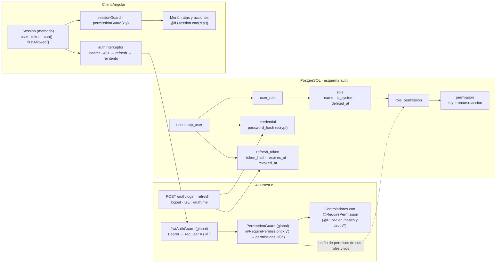

# Identidad, roles y permisos — concepto de diseño

Documento de referencia para reproducir en otro proyecto el modelo de identidad y autorización que usa
esta app. Está escrito para que un agente (o una persona) pueda portarlo sin leer el resto del repo:
explica el porqué de cada decisión, el contrato de cada pieza (base, API y client), la mecánica de la
sesión y las convenciones que hacen que un permiso nuevo se aplique en todas las capas.

Stack de origen: PostgreSQL 16, NestJS 12 (ESM) con Prisma 7, Angular 21 standalone con signals y
zoneless. Nada del diseño depende del framework en esencia; sí la implementación de referencia.

---

## 1. Idea central

Tres capas con una sola fuente de verdad:

1. **Catálogo fijo de permisos** (`recurso.accion`) definido en el código y cargado en la base con el
   esquema. Los permisos son las acciones que la API sabe hacer; **no se inventan desde el admin**.
2. **Roles editables** desde el admin: un rol es un nombre más un conjunto de permisos del catálogo.
   Se asignan a personas; una persona puede tener varios. Hay roles del sistema que no se renombran ni
   eliminan (pero sí cambian de permisos).
3. **Identidad propia** con email y contraseña, sin proveedor externo: access token JWT corto, refresh
   token rotativo en cookie `httpOnly`, y la API exige en cada endpoint el permiso que declara.

Principios que se fijaron con el uso y hay que preservar al portar:

- **Los permisos efectivos se calculan en la base en cada petición**, no se meten en el JWT. Un cambio
  de rol surte efecto de inmediato; el token solo dice quién eres (`sub`).
- **Roles globales.** Qué administra cada persona sobre cada unidad lo dice otro modelo (contratos), no el rol.
- **El client oculta, la API prohíbe.** La interfaz no muestra lo que no se puede hacer; la API responde
  401 sin token y 403 sin permiso aunque alguien llame a mano. El client nunca es la única barrera.
- **Un permiso nuevo se declara en cinco lugares conocidos** (ver §6). No hay lógica de autorización
  dispersa en servicios.
- **El access token vive en memoria.** Nunca en `localStorage`; al recargar la página se recupera con la
  cookie de refresh. El JavaScript nunca ve el refresh token.
- **El seed trae una persona por rol** con la misma contraseña conocida, para probar cada perfil.

### 1.1 Cómo encajan las piezas



### 1.2 Ciclo de la sesión

```mermaid
sequenceDiagram
  participant B as Navegador (client)
  participant A as API
  B->>A: POST /auth/login {email, password}
  A-->>B: 200 {accessToken (15 min), user{roles, permissions}} + Set-Cookie refresh_token (httpOnly, Path=/auth, 30 días)
  B->>A: GET /units · Authorization: Bearer <access>
  A-->>B: 200 (JwtAuthGuard ok, PermissionGuard: units.read ∈ permisos)
  Note over B,A: pasan 15 minutos
  B->>A: GET /units · Bearer <access expirado>
  A-->>B: 401
  B->>A: POST /auth/refresh (cookie)
  A-->>B: 200 {accessToken nuevo} + cookie rotada; el refresh usado queda revocado
  B->>A: GET /units · Bearer <access nuevo>  (reintento automático)
  A-->>B: 200
  B->>A: POST /auth/logout (cookie)
  A-->>B: 204 · refresh revocado · cookie borrada
```

---

## 2. Base de datos (esquema `auth`)

```sql
-- Catálogo fijo. La CHECK garantiza que key sea exactamente recurso.accion.
CREATE TABLE auth.permission (
  key text PRIMARY KEY, resource text NOT NULL, action text NOT NULL, description text NOT NULL,
  CONSTRAINT permission_key_format CHECK (key = resource || '.' || action)
);
INSERT INTO auth.permission VALUES
  ('summary.read','summary','read','Ver las métricas del inicio'),
  ('units.read','units','read','…'), ('units.write','units','write','…'), ('units.delete','units','delete','…'),
  ('contracts.read','contracts','read','…'), ('contracts.write','contracts','write','…'),
  ('users.read','users','read','…'), ('users.write','users','write','…'),
  ('roles.read','roles','read','…'), ('roles.write','roles','write','…');

-- Roles: nombre único entre vivos (citext), borrado lógico, roles del sistema.
CREATE TABLE auth.role (
  id uuid PRIMARY KEY DEFAULT gen_random_uuid(),
  name citext NOT NULL, description text,
  is_system boolean NOT NULL DEFAULT false,      -- no se elimina ni renombra; sí cambia de permisos
  deleted_at timestamptz, created_at …, updated_at …
);
CREATE UNIQUE INDEX role_name_uq ON auth.role (name) WHERE deleted_at IS NULL;

CREATE TABLE auth.role_permission (role_id uuid REFERENCES auth.role ON DELETE CASCADE, permission_key text REFERENCES auth.permission ON DELETE CASCADE, PRIMARY KEY (role_id, permission_key));
CREATE TABLE auth.user_role       (user_id uuid REFERENCES users.app_user ON DELETE CASCADE, role_id uuid REFERENCES auth.role ON DELETE CASCADE, created_at …, PRIMARY KEY (user_id, role_id));

-- El rol del sistema existe siempre y tiene todo: va en schema.sql, no en el seed.
INSERT INTO auth.role (id, name, description, is_system) VALUES ('7000…0001', 'admin', 'Acceso completo', true);
INSERT INTO auth.role_permission SELECT '7000…0001', key FROM auth.permission;

-- Identidad. La credencial es una tabla aparte: una cuenta puede existir sin poder entrar todavía.
CREATE TABLE auth.credential (
  user_id uuid PRIMARY KEY REFERENCES users.app_user ON DELETE CASCADE,
  password_hash text NOT NULL,                    -- scrypt$N$r$p$salt$hash
  created_at …, updated_at …
);
-- Solo el hash del refresh token: leer la tabla no da tokens utilizables. Cada uso revoca y emite otro.
CREATE TABLE auth.refresh_token (
  id uuid PRIMARY KEY DEFAULT gen_random_uuid(),
  user_id uuid NOT NULL REFERENCES users.app_user ON DELETE CASCADE,
  token_hash text NOT NULL UNIQUE, expires_at timestamptz NOT NULL, revoked_at timestamptz, created_at …
);
CREATE INDEX refresh_token_user_idx ON auth.refresh_token (user_id) WHERE revoked_at IS NULL;
```

Decisiones:

- **Catálogo en `schema.sql`, roles de ejemplo en `seed.sql`.** El catálogo y el rol `admin` son código;
  los demás roles y las personas son datos de ejemplo.
- **Contraseña con scrypt de Node** (`crypto.scryptSync`, N=16384, r=8, p=1, salt de 16 bytes, clave de 64):
  sin dependencias nativas, formato autodescriptivo `scrypt$N$r$p$salt$hash`. `verifyPassword` usa
  `timingSafeEqual`. Cambiar de algoritmo = cambiar el prefijo y verificar por esquema.
- **Roles del seed** (permisos de partida, editables): `admin` (todo), `administrador-comunitario` (todo
  salvo `roles.write`), `anfitrion` y `propietario` (lecturas de unidades, contratos y usuarios),
  `residente` (unidades y contratos), `servicio-externo` (unidades), `visita` (nada), `read-only` (todos los `.read`).
  Una persona por rol; todas con la contraseña `Comunidad2026!`.

---

## 3. API

### 3.1 Tablas (capa `database/tables`)

Los servicios nunca tocan Prisma; inyectan clases "tabla" con DTOs en camelCase.

```ts
// AppUserTable
permissionsOf(userId): Promise<string[]>        // DISTINCT permission_key de los roles vivos del usuario
findAccount(userId): Promise<Account | null>    // datos + roles + permissions (lo que ve la sesión)
setRoles(userId, roleIds): Promise<void>        // reemplaza el conjunto (transacción: deleteMany + createMany)

// RoleTable
listPermissions()  permissionsExist(keys)  list()  find(id)  allExist(ids)  existsName(name, exceptId?)
create({name, description, permissions})  update(id, {name?, description?, permissions?})  softDelete(id)
addUser(roleId, userId)  /* upsert: idempotente */  removeUser(roleId, userId)

// CredentialTable
findByEmail(email): {userId, passwordHash, isActive} | null
setPassword(userId, hash)
createRefreshToken(userId, token, expiresAt)    // guarda sha256(token)
findValidRefreshToken(token): {id, userId} | null   // no revocado y no expirado
revokeRefreshToken(id)  revokeAllRefreshTokens(userId)
```

### 3.2 Endpoints de identidad

| Método | Ruta            | Público | Respuesta |
|--------|-----------------|---------|-----------|
| POST   | `/auth/login`   | sí | `{ accessToken, user: Account }` + `Set-Cookie: refresh_token=…; HttpOnly; SameSite=Lax; Path=/auth; Expires=+30d` (Secure en producción) |
| POST   | `/auth/refresh` | sí | Igual que login, con la cookie rotada. El refresh usado queda `revoked_at = now()` |
| POST   | `/auth/logout`  | sí | 204; revoca el refresh de la cookie y la borra |
| GET    | `/auth/me`      | no | `Account` de la sesión |

`Account = { id, email, fullName, phone, isActive, roles: {id, name}[], permissions: string[] }`.

Reglas del servicio: el mismo mensaje para email desconocido y contraseña errónea ("Email o contraseña
incorrectos"); cuenta inactiva → 401 aunque la contraseña sea correcta; el refresh token es de 48 bytes
aleatorios en base64url y en el cuerpo solo viaja el access token.

### 3.3 Guards globales y decoradores

```ts
// auth.decorators.ts
export const Public = () => SetMetadata('isPublic', true);
export const RequirePermission = (key: string) => SetMetadata('permission', key);
export const CurrentUser = createParamDecorator((_, ctx) => ctx.switchToHttp().getRequest().user); // { id }

// JwtAuthGuard: salvo @Public(), exige Authorization: Bearer <jwt>; verifica y deja req.user = { id: payload.sub }.
//   Falta o inválido → 401.
// PermissionGuard: si el handler (o la clase) declara @RequirePermission, carga findAccount(req.user.id);
//   cuenta inexistente o inactiva → 401; sin el permiso → 403 `No tienes el permiso ${key}`.
// Ambos se registran como APP_GUARD en AuthModule, en ese orden.
```

Los controladores declaran el permiso por método; la convención es una fila por recurso:

| Recurso | `read` | `write` | `delete` |
|---|---|---|---|
| `units` | `GET /units*` | `POST /units`, `PATCH /units/:id` | `DELETE /units/:id`, `POST /units/:id/restore` |
| `contracts` | `GET /contracts/:id` | `POST /units/:id/contracts`, `PATCH /contracts/:id` | |
| `users` | `GET /users*` | `POST /users`, `PATCH /users/:id` (incluye `roleIds`) | |
| `roles` | `GET /permissions`, `GET /roles*` | `POST/PATCH/DELETE /roles*`, `PUT/DELETE /roles/:id/users/:userId` | |
| `summary` | `GET /summary` | | |

Errores en el envoltorio común de la API: `{ success: false, status, code: 'UNAUTHORIZED' | 'FORBIDDEN', message, traceId }`.

### 3.4 Reglas de roles (RolesService)

- Nombre único entre vivos → 409. Permisos fuera del catálogo → 400. `permissions` siempre reemplaza el conjunto.
- Rol del sistema: `PATCH` con otro nombre → 400 "no se puede renombrar"; `DELETE` → 400. Sí acepta cambios de permisos y descripción.
- `DELETE /roles/:id` es lógico (`deleted_at`); el rol desaparece de listas y de las personas.
- `PUT /roles/:id/users/:userId` exige que la persona exista (400) y es idempotente.

### 3.5 Configuración

| Variable | Uso | Por defecto |
|---|---|---|
| `JWT_SECRET` | Firma HS256 del access token. Obligatoria. | — |
| `JWT_ACCESS_TTL` | Duración del access token | `15m` |
| `REFRESH_TTL_DAYS` | Duración del refresh token | `30` |
| `CLIENT_ORIGIN` | Origen permitido en CORS (con `credentials: true`) | `http://localhost:4201` |

`main.ts`: `cookieParser()`, `enableCors({ origin, credentials: true })`. En Docker las variables pasan
por el compose al contenedor de la API; cambiar `.env` exige recrear el contenedor (`docker compose up -d api`).

---

## 4. Client

### 4.1 `Session` — la sesión en memoria

```ts
@Injectable({ providedIn: 'root' })
export class Session {
  readonly user = signal<Account | null>(null);
  readonly token = signal<string | null>(null);       // access token; nunca en localStorage
  readonly isLoggedIn = computed(() => this.user() !== null);

  can(permission: string): boolean;                    // user.permissions.includes(permission)
  firstAllowed(): string | null;                       // primera sección de SECTIONS que puede ver
  login(email, password): Promise<void>;               // POST /auth/login (withCredentials)
  restore(): Promise<boolean>;                         // POST /auth/refresh una sola vez aunque la llamen varios a la vez
  refreshToken(): Promise<string | null>;              // tras un 401; null = sesión perdida (y la limpia)
  logout(): Promise<void>;                             // POST /auth/logout y limpia
}
```

`SECTIONS` (`core/sections.ts`) es la lista ordenada de secciones con su permiso: `Inicio → summary.read`,
`Comunidades/Árbol → units.read`, `Usuarios → users.read`, `Roles → roles.read`. La usan el menú, los guards y
`firstAllowed()`: quien entra va a la primera que puede ver; quien no puede ver ninguna, a `/admin/sin-acceso`.

### 4.2 Interceptor y guards

```ts
// authInterceptor: por fuera del interceptor que desenvuelve `data`.
//   /auth/* pasa tal cual (las llamadas llevan withCredentials para la cookie).
//   Resto: añade Bearer <token>. Ante 401: session.refreshToken() → si hay token nuevo, repite la petición;
//   si no, router.navigate(['/login'], { queryParams: { returnUrl } }) y propaga el error.
// sessionGuard (en /admin): isLoggedIn() || await restore(); si no, UrlTree a /login?returnUrl=…
// permissionGuard('x.y') (en cada sección): can(x.y) || UrlTree a firstAllowed() ?? '/admin/sin-acceso'
```

### 4.3 Interfaz por permiso

- Layout: `sections = computed(() => SECTIONS.filter(s => session.can(s.permission)))`; muestra la persona y *Salir*.
- Páginas: `protected readonly canWrite = this.session.can('units.write')` y `@if (canWrite) { … }` alrededor de
  cada botón de alta, edición, eliminación o restauración. Los componentes hoja que no conocen la sesión
  (p. ej. el nodo recursivo del árbol) reciben `canWrite`/`canDelete` como inputs.
- **Se oculta, no se deshabilita.** Los enlaces de navegación (*Abrir*) siguen visibles: los cubre `units.read`.
- `/login` es la única página pública. Tras entrar: `returnUrl` si lo hay, si no `firstAllowed()`.

### 4.4 Pruebas

- `core/session.testing.ts`: `fakeSession(permissions)` y `provideSessionWith(permissions)` sin `vi.fn()`
  (el archivo entra en la compilación de la app; los specs espían con `vi.spyOn(session, 'login')`).
- Cada spec de página añade `provideSessionWith(ALL_PERMISSIONS)` y, cuando importa, uno con menos permisos
  para comprobar que los botones desaparecen.
- API: `test/session.helper.ts` con `loginAs(app, email)` que devuelve `{ token, cookie, auth }`; todos los e2e
  hacen `.set(session.auth)`. Nunca modificar los roles de la persona con la que se inició sesión en un test:
  el guard lee los permisos de la base en cada petición y el resto del test se queda sin acceso.

---

## 5. Convenciones de permisos

- Clave `recurso.accion` en minúsculas, con `read` / `write` / `delete`. `write` cubre crear y modificar;
  `delete` cubre eliminar y restaurar (borrado lógico). Un recurso puede no tener las tres.
- El nombre del recurso coincide con el controlador (`units`, `users`, `roles`, `contracts`, `summary`).
- Etiquetas en español en el client (`PERMISSION_RESOURCE_LABELS`, `PERMISSION_ACTION_LABELS`):
  "Unidades · Crear y modificar". El wizard de rol agrupa por recurso (`groupPermissions`).
- Un rol sin permisos es válido: sirve para agrupar personas (`visita`).

---

## 6. Cómo agregar un permiso nuevo

Cinco puntos de contacto, siempre los mismos:

1. `database/schema.sql`: fila en `auth.permission` (y el `INSERT … SELECT` del rol `admin` la toma solo).
2. `database/seed.sql`: qué roles de ejemplo lo reciben.
3. API: `@RequirePermission('recurso.accion')` en los métodos que lo exigen.
4. Client: `SECTIONS` si abre una sección nueva; `session.can(...)` alrededor de sus acciones; etiquetas en `labels.ts` si el recurso o la acción son nuevos.
5. Tests: e2e con un perfil que no lo tenga (403) y uno que sí; spec de la página con y sin él.

---

## 7. Lista de comprobación para portar

1. Esquema `auth` con las seis tablas de §2, el catálogo y el rol del sistema en el schema, roles de ejemplo y una persona por rol en el seed.
2. Hash de contraseña con formato autodescriptivo y verificación en tiempo constante.
3. Endpoints `login`, `refresh`, `logout`, `me`; access token corto en el cuerpo, refresh rotativo solo en cookie `httpOnly` con `Path` restringido.
4. Dos guards globales: identidad (401) y permiso (403) leyendo los permisos de la base por petición; `@Public` para las excepciones.
5. Cada endpoint declara su permiso; una tabla recurso × acción en el README.
6. Client: sesión en memoria con `restore()` por cookie, interceptor con refresh y reintento, guard de sesión y guard de permiso por sección, menú y acciones ocultas con `can()`.
7. Helper de sesión falsa para specs y `loginAs` para e2e.
8. Variables `JWT_SECRET`, `JWT_ACCESS_TTL`, `REFRESH_TTL_DAYS`, `CLIENT_ORIGIN` documentadas y pasadas al contenedor.

Pendiente en la implementación de referencia, y por tanto en quien la porte: alta de credenciales y cambio
de contraseña desde el admin (hoy una cuenta creada desde Usuarios no puede entrar hasta tener fila en
`auth.credential`), y recuperación de contraseña.
