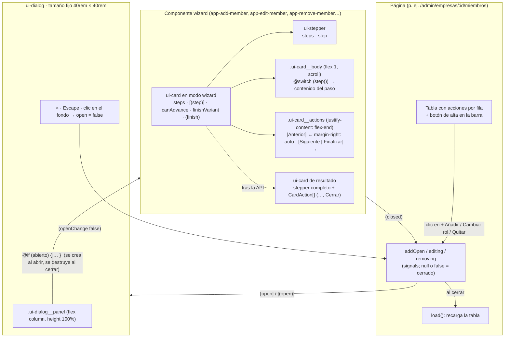
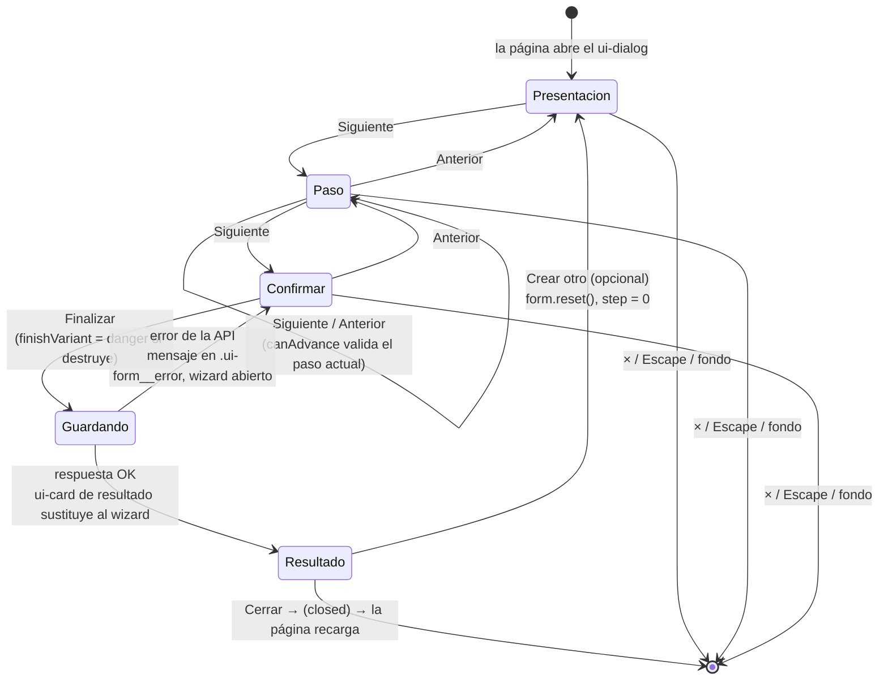

# Modales y wizards por pasos — concepto de diseño

Documento de referencia para reproducir en otro proyecto el patrón de "acción en un modal con
pasos" que usa esta app. Está escrito para que un agente (o una persona) pueda portarlo sin leer
el resto del repo: explica el porqué de cada decisión, el contrato de cada pieza, la mecánica CSS
que lo sostiene y las convenciones que hacen que todos los wizards se sientan iguales.

Stack de origen: Angular 21 standalone, signals, zoneless, SCSS plano con BEM (`ui-x__y`) y tokens
`--ui-color-*`. Nada del patrón depende de Angular en esencia; sí la implementación de referencia.

---

## 1. Idea central

Toda acción que crea, modifica o elimina algo desde una tabla se hace **sin salir de la página**,
dentro de un **modal de tamaño fijo** que contiene un **wizard de pasos**. La página que abre el
modal no sabe nada del flujo: solo lo abre y, cuando se cierra, recarga sus datos.

Principios que se fijaron con el uso y que hay que preservar al portar:

1. **Un wizard por funcionalidad.** Crear, cambiar y eliminar son wizards distintos, aunque el de
   eliminar solo tenga dos pasos. No hay `confirm()` nativos ni selects "en línea" que guarden al
   cambiar: toda mutación pasa por Presentación → … → Confirmar → tarjeta de resultado.
2. **Los botones no se mueven.** El modal mide siempre lo mismo y la fila de acciones está anclada
   abajo, así *Anterior / Siguiente / Finalizar / Cerrar* caen en la misma posición en todos los
   pasos y en todos los wizards. Un clic repetido cae sobre el mismo botón.
3. **La acción principal siempre a la derecha; solo *Anterior* a la izquierda.** Vale para los
   botones del wizard y para los de la tarjeta de resultado (*Cerrar*, *Entrar*…).
4. **Lo destructivo se ve distinto.** El botón *Finalizar* de un wizard que elimina o da de baja
   usa la variante `danger`; *Siguiente* no cambia porque avanzar no destruye nada.
5. **El primer paso siempre explica.** "Vas a hacer X en Y" más una lista de lo que viene. El
   último paso siempre resume y muestra el error de la API si lo hay, sin cerrar el wizard.
6. **La tarjeta de resultado sustituye al wizard**, no aparece debajo: mismo `ui-card`, stepper
   completado, datos de lo creado y acciones (*Cerrar*, y opcionalmente *Crear otro*).

### 1.1 Cómo encajan las piezas



### 1.2 Ciclo de vida de un wizard



---

## 2. Piezas y contratos

Cuatro componentes de la librería `ui/` y una convención para los componentes de wizard.

### 2.1 `ui-dialog` — el modal

Envoltorio sobre `<dialog>` nativo. **No aporta superficie visual** (fondo transparente, sin
padding): el contenido trae su propia tarjeta. Se cierra con Escape, clic en el fondo o el botón ×,
y el estado siempre vuelve al padre por `[(open)]`.

```ts
// dialog.ts
export class Dialog {
  readonly open = model(false);                      // [(open)] bidireccional
  private readonly dialog = viewChild.required<ElementRef<HTMLDialogElement>>('dialog');
  constructor() {
    effect(() => {                                   // sincroniza el signal con showModal()/close()
      const el = this.dialog().nativeElement;
      if (this.open() && !el.open) el.showModal();
      else if (!this.open() && el.open) el.close();
    });
  }
  protected close(): void { this.open.set(false); }
  protected onBackdropClick(e: MouseEvent): void {   // el fondo es el propio <dialog>; el contenido no
    if (e.target === this.dialog().nativeElement) this.close();
  }
}
```

```html
<!-- dialog.html -->
<dialog #dialog class="ui-dialog" (close)="open.set(false)" (click)="onBackdropClick($event)">
  <div class="ui-dialog__panel">
    <button type="button" class="ui-dialog__close" aria-label="Cerrar" (click)="close()">×</button>
    <ng-content />
  </div>
</dialog>
```

```scss
// dialog.scss — TAMAÑO FIJO: no depende del contenido (principio 2)
.ui-dialog {
  width: min(40rem, calc(100vw - 2rem));
  height: min(40rem, calc(100vh - 2rem));
  padding: 0; border: 0; background: transparent; color: inherit;
  &::backdrop { background-color: rgb(0 0 0 / 40%); }
}
.ui-dialog__panel { display: flex; flex-direction: column; position: relative; height: 100%; }
.ui-dialog__close { position: absolute; top: 0.75rem; right: 0.75rem; z-index: 1; /* … */ }

// Lo proyectado (host del componente wizard, su div raíz y el ui-card) estira al alto del panel,
// para que el ui-card pueda anclar sus acciones abajo. ::ng-deep porque esos nodos no llevan el
// ámbito de este componente (encapsulación emulada). En otro framework: aplicar estas tres reglas
// a los tres niveles que haya entre el panel y la tarjeta.
:host ::ng-deep .ui-dialog__panel > :not(.ui-dialog__close),
:host ::ng-deep .ui-dialog__panel > :not(.ui-dialog__close) > *,
:host ::ng-deep .ui-dialog__panel > :not(.ui-dialog__close) > * > ui-card {
  display: flex; flex: 1; flex-direction: column; min-height: 0;
}
```

Uso desde una página (patrón "abrir y recargar al cerrar"):

```html
<ui-dialog [(open)]="addOpen" (openChange)="onAddOpenChange($event)">
  @if (addOpen()) {                     <!-- se instancia al abrir y se destruye al cerrar: estado limpio -->
    <app-add-member [companyId]="companyId" (closed)="onAddOpenChange(false)" />
  }
</ui-dialog>

<!-- Para wizards "sobre una fila", el estado es el elemento en edición; null = cerrado -->
<ui-dialog [open]="editing() !== null" (openChange)="onEditOpenChange($event)">
  @if (editing(); as member) {
    <app-edit-member [member]="member" (closed)="onEditOpenChange(false)" />
  }
</ui-dialog>
```

```ts
protected onAddOpenChange(open: boolean): void { if (!open) { this.addOpen.set(false); this.load(); } }
protected onEditOpenChange(open: boolean): void { if (!open) { this.editing.set(null); this.load(); } }
```

### 2.2 `ui-card` — superficie y motor del wizard

Una tarjeta normal (título, contenido, acciones) que **en modo wizard** muestra el `ui-stepper` y
los botones *Anterior / Siguiente / Finalizar*. Es el único sitio donde vive la navegación: los
componentes de wizard no pintan botones de navegación nunca.

```ts
// card.ts
export interface CardAction { id: string; label: string; variant?: 'primary' | 'secondary' | 'ghost' | 'danger'; disabled?: boolean; }

export class Card {
  readonly heading = input<string>();
  readonly content = input<string>();
  readonly actions = input<CardAction[]>([]);        // botones "libres" (tarjeta de resultado)

  // Modo wizard: con steps aparece el stepper y la navegación
  readonly steps = input<string[]>([]);
  readonly step = model(0);                          // [(step)] bidireccional
  readonly canAdvance = input(true);                 // false deshabilita Siguiente / Finalizar
  readonly finishVariant = input<'primary' | 'danger'>('primary'); // Finalizar en rojo si destruye

  readonly action = output<string>();                // id de la CardAction pulsada
  readonly finish = output<void>();                  // Finalizar en el último paso

  protected readonly isLastStep = computed(() => this.step() >= this.steps().length - 1);
  protected prev(): void { this.step.update((s) => s - 1); }
  protected next(): void { this.isLastStep() ? this.finish.emit() : this.step.update((s) => s + 1); }
}
```

```html
<!-- card.html -->
<div class="ui-card">
  @if (heading()) { <h3 class="ui-card__title">{{ heading() }}</h3> }
  @if (steps().length) { <ui-stepper class="ui-card__stepper" [steps]="steps()" [step]="step()" /> }
  <div class="ui-card__body">
    @if (content()) { <p class="ui-card__content">{{ content() }}</p> }
    <ng-content />
  </div>
  @if (actions().length || steps().length) {
    <div class="ui-card__actions">
      @for (item of actions(); track item.id) {
        <ui-button [variant]="item.variant ?? 'primary'" [disabled]="item.disabled ?? false" (clicked)="action.emit(item.id)">{{ item.label }}</ui-button>
      }
      @if (steps().length) {
        @if (step() > 0) { <ui-button class="ui-card__prev" variant="secondary" (clicked)="prev()">Anterior</ui-button> }
        <ui-button [variant]="isLastStep() ? finishVariant() : 'primary'" [disabled]="!canAdvance()" (clicked)="next()">
          {{ isLastStep() ? 'Finalizar' : 'Siguiente' }}
        </ui-button>
      }
    </div>
  }
</div>
```

```scss
// card.scss — columna flex: si el contenedor fija la altura (ui-dialog), el cuerpo crece y las acciones quedan abajo
.ui-card { display: flex; flex: 1; flex-direction: column; min-height: 0; padding: 1.25rem; border: 1px solid var(--ui-color-border); border-radius: 0.75rem; background-color: var(--ui-color-surface); }
.ui-card__body { flex: 1; min-height: 0; overflow: auto; }     // scroll dentro del paso, nunca en el modal
.ui-card__actions { display: flex; flex-wrap: wrap; justify-content: flex-end; gap: 0.75rem; margin-top: 1rem; } // principio 3
.ui-card__prev { margin-right: auto; }                          // solo Anterior a la izquierda
.ui-card__stepper { display: block; margin-bottom: 1rem; }
```

Fuera de un modal nada fija la altura, así que la tarjeta se comporta como un bloque normal: el
mismo componente sirve para listados.

### 2.3 `ui-stepper` — indicador de pasos

Solo presentación. Marca con ✓ los pasos anteriores, resalta el activo (`aria-current="step"`) y
numera los siguientes. Con `step = steps.length` se ve "todo completado", que es lo que usa la
tarjeta de resultado.

```ts
export class Stepper { readonly steps = input.required<string[]>(); readonly step = input.required<number>(); }
```

```html
<ol class="ui-stepper">
  @for (label of steps(); track $index) {
    <li class="ui-stepper__item" [class.ui-stepper__item--done]="$index < step()" [class.ui-stepper__item--active]="$index === step()" [attr.aria-current]="$index === step() ? 'step' : null">
      <span class="ui-stepper__marker">{{ $index < step() ? '✓' : $index + 1 }}</span>
      <span class="ui-stepper__label">{{ label }}</span>
    </li>
  }
</ol>
```

CSS esencial: `ol` en flex con cada `li` `flex: 1` y centrado; conector con `::after` absoluto a la
altura del marcador (`top: 0.875rem; left: 50%; width: 100%; height: 2px`) que se pinta con
`--ui-color-primary` en los pasos hechos; marcador circular de `1.75rem` con borde de 2px, relleno
primario cuando está hecho o activo.

### 2.4 `ui-button` — variantes

`primary` (acción principal), `secondary` (Anterior), `ghost` (acciones secundarias como *Crear
otro* o *Quitar* en una tabla) y `danger` (solo *Finalizar* de wizards destructivos). Tokens:
`--ui-color-primary/-hover`, `--ui-color-on-primary`, `--ui-color-danger/-hover`, definidos en
tema claro y oscuro.

---

## 3. Anatomía de un componente wizard

Cada funcionalidad es un componente standalone que se monta dentro del `ui-dialog`. Plantilla
canónica (`app-add-member`, alta de miembro en una empresa):

```ts
@Component({ selector: 'app-add-member', imports: [ReactiveFormsModule, Card, Stepper, Tag], templateUrl: '…', styleUrl: '…' })
export class AddMember implements OnInit {
  readonly companyId = input.required<string>();      // contexto que da la página
  readonly companyName = input.required<string>();
  readonly memberIds = input<string[]>([]);
  readonly closed = output<void>();                   // única salida: "ciérrame"

  protected readonly steps = ['Presentación', 'Usuario', 'Rol', 'Confirmar'];
  protected readonly step = signal(0);
  protected readonly saving = signal(false);
  protected readonly error = signal<string | null>(null);
  protected readonly added = signal<CompanyMember | null>(null);   // != null → tarjeta de resultado
  protected readonly resultActions: CardAction[] = [
    { id: 'another', label: 'Añadir otro', variant: 'ghost' },
    { id: 'close', label: 'Cerrar' },                 // la primaria va ÚLTIMA: queda más a la derecha
  ];

  protected readonly form = inject(NonNullableFormBuilder).group({ userId: ['', Validators.required], role: ['recruiter' as CompanyRole] });
  protected readonly value = toSignal(this.form.valueChanges, { initialValue: this.form.getRawValue() }); // zoneless: la plantilla decide con señales

  protected readonly canAdvance = computed(() => {
    switch (this.step()) {
      case 1: return this.selectedUser() !== null;    // cada paso valida lo suyo
      case 3: return !this.saving();                  // el último bloquea mientras guarda
      default: return true;
    }
  });

  protected finish(): void {                          // Finalizar → llamada a la API
    this.saving.set(true); this.error.set(null);
    this.api.addMember(this.companyId(), v.userId, v.role).subscribe({
      next: (member) => { this.added.set(member); this.saving.set(false); },
      error: (e: HttpErrorResponse) => {              // el envoltorio de la API trae message (string o string[])
        const m = e.error?.message;
        this.error.set(Array.isArray(m) ? m.join('. ') : (m ?? 'No se pudo añadir el miembro'));
        this.saving.set(false);
      },
    });
  }

  protected onResult(action: string): void {
    if (action === 'close') { this.closed.emit(); return; }
    this.form.reset(); this.added.set(null); this.error.set(null); this.step.set(0);   // "otro": reinicia
  }
}
```

```html
<div class="add-member">
  @if (added(); as member) {
    <ui-card heading="Miembro añadido" [actions]="resultActions" (action)="onResult($event)">
      <ui-stepper class="add-member__stepper" [steps]="steps" [step]="steps.length" />   <!-- completado -->
      <p class="add-member__result-name">{{ member.fullName }}</p>
      <div class="ui-tags"><ui-tag>{{ roleLabels[member.role] }}</ui-tag></div>
    </ui-card>
  } @else {
    <ui-card heading="Añadir miembro" [steps]="steps" [(step)]="step" [canAdvance]="canAdvance()" (finish)="finish()">
      <form [formGroup]="form">
        @switch (step()) {
          @case (0) { <p>Vas a dar de alta un miembro en <strong>{{ companyName() }}</strong>:</p> <ol class="add-member__intro">…</ol> }
          @case (1) { <label class="ui-field"><span class="ui-field__label">Usuario</span><select class="ui-select" formControlName="userId">…</select></label> }
          @case (2) {
            <div class="add-member__roles">
              <label class="ui-checkbox"><input type="radio" formControlName="role" value="recruiter" /> Reclutador</label>
              <label class="ui-checkbox"><input type="radio" formControlName="role" value="owner" /> Propietario</label>
            </div>
          }
          @case (3) {
            <dl class="add-member__summary">…resumen…</dl>
            @if (error(); as error) { <p class="ui-form__error">{{ error }}</p> }
          }
        }
      </form>
    </ui-card>
  }
</div>
```

Variantes del mismo esqueleto:

| Wizard | Pasos | Particularidades |
|---|---|---|
| Crear (usuario, empresa, miembro) | Presentación, [datos…], Confirmar | Resultado con *Crear otro* (ghost) + *Cerrar* |
| Modificar (empresa, rol de miembro) | Presentación, [datos…], Confirmar | Carga el actual en `ngOnInit`; `canAdvance` exige un cambio real (`value().role !== member().role`) |
| Eliminar / dar de baja | Presentación, Confirmar | `finishVariant="danger"`; la presentación explica consecuencias (baja lógica, límites como "al menos un propietario") |

Reglas que se repiten en todos:

- El wizard **no navega ni recarga**: emite `closed` y la página decide.
- El **error de la API se muestra en el paso Confirmar** y el wizard sigue abierto para corregir.
- Los **radios llevan `value` literal** (`value="owner"`), no `[value]`: con binding Angular no
  escribe el atributo y los tests que buscan `input[value="owner"]` no lo encuentran.
- Los **formularios usan clases globales** (`.ui-field`, `.ui-input`, `.ui-select`, `.ui-checkbox`,
  `.ui-form__error`), no componentes de formulario.
- Estilos propios mínimos y siempre los mismos nombres: `x__intro` (lista del primer paso),
  `x__roles` (fila de radios), `x__summary` (dl del resumen), `x__stepper`, `x__result-name`.

---

## 4. Cómo se prueba (vitest + TestBed, jsdom)

- jsdom no implementa `showModal()`/`close()`: los specs que abren un `ui-dialog` llaman a
  `polyfillDialog()` (`dialog.testing.ts`) en `beforeAll`. El polyfill pone `open = true/false` y
  despacha `close`.
- Para avanzar un wizard en un test se pulsa **el último botón de `.ui-card__actions`**, que por el
  principio 3 es siempre la acción principal: `[...el.querySelectorAll('.ui-card__actions button')].at(-1)!.click()`.
- Los inputs del wizard se fijan con `fixture.componentRef.setInput(...)` y `closed` se observa con
  `fixture.componentInstance.closed.subscribe(spy)`.
- La página se prueba en tres tiempos: abre (aparece `app-x` dentro de `dialog`), cierra con
  `.ui-dialog__close`, y se comprueba la recarga (`http.expectOne(...)` del listado).

---

## 5. Lista de comprobación para portar

1. Tokens: `--ui-color-{bg,surface,border,border-strong,hover,text,text-body,text-muted,primary,primary-hover,on-primary,danger,danger-hover}` en tema claro y oscuro.
2. `ui-button` con las cuatro variantes.
3. `ui-stepper` presentacional con `steps` y `step`.
4. `ui-card` con `actions`, modo wizard (`steps`, `step`, `canAdvance`, `finishVariant`, `finish`), columna flex y acciones a la derecha con *Anterior* a la izquierda.
5. `ui-dialog` de **tamaño fijo**, sin superficie propia, con la cadena flex hasta la tarjeta y cierre por Escape/fondo/×.
6. Un componente por funcionalidad con `closed` y tarjeta de resultado; la página abre, y recarga al cerrar.
7. Primer paso explicativo, último paso con resumen y error; `danger` solo en *Finalizar* de lo destructivo.
8. Tests con `polyfillDialog` y "último botón de acciones".

Si el framework de destino no tiene `<dialog>` nativo o encapsulación emulada, lo único que cambia
es cómo se implementan los puntos 5 y 6: el resto son decisiones de diseño, no de tecnología.
